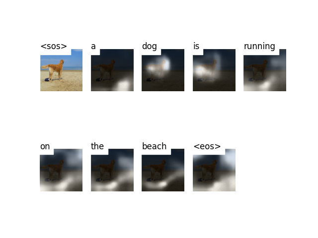

# 
<h1 align="center">
        Show, Attend & Tell
</h1>
<h4 align="center">
    <p>
        <b>English</b> |
        <a href="https://github.com/NicholasKX/ShowAttendTell/blob/main/README_zh.md">简体中文</a>
    </p>
</h4>
<h3 align="center">
    <p>Mindspore Implementation of "Show, Attend and Tell: Neural Image Caption Generation with Visual Attention"</p>
</h3>


## Pre-requisites

* Mindspore=2.0.0
* Convolutional Neural Networks
* Long Short Term Memory Cells
* Attention Mechanism

## Environment
* Ascend910 or RTX 3090
* Mindspore=2.0.0
* Python=3.8.0
* mode=ms.PyNative

## Usage
Clone the repo:
```bash
git clone https://github.com/NicholasKX/ShowAttendTell.git
```

### 1. Flickr8k Dataset 
* Prepare Dataset  ([**Flickr8k**](https://www.kaggle.com/shadabhussain/flickr8k)). 
* Extract and move images to a folder named **Images** and text to **captions.txt**. 
* Put the folder containing **Images** and **captions.txt** in a folder named **flickr8k** 
* Use [**Andrej Karpathy**](http://cs.stanford.edu/people/karpathy/deepimagesent/caption_datasets.zip)'s training, validation, and test splits.
```angular2html
-- flickr8k
    |-- Images
      |-- 1000268201_693b08cb0e.jpg
      |-- ......
    |-- captions.txt
    |-- train.csv
    |-- val.csv
    |-- test.csv
```

### 2. Training
* Run the following command : 
```bash
python train.py
```
* You should specify the path of the **checkpoint file** in the _train.py_ file.
* You can change the hyperparameters in the _train.py_ file alternatively.
* The model will be saved in the _model_saved_ folder
### 3. Inference
* Download the [**checkpoint file**]([https://openi.pcl.ac.cn/Kayxxx/ShowAndTell/src/branch/master/model_saved](https://drive.google.com/drive/folders/1gIUfmDfPlbkbAqr0vo2RKRozgwLckXjM?usp=sharing)) and put it in the _model_saved_ folder.
* Run the following command : 
```bash
python caption.py --img <path_to_image> --beam_size <beam search>
```
### 4. Evaluation
* Run the following command : 
```bash
python evaluation.py
```


### 5. Results
Some of the results obtained are shown below :
<p align="center">
  
</p>
<pre><code> Caption : a dog is running on the beach . </code></pre> 

<p align="center">
  
</p>
<pre><code> Caption : a man is standing on top of a mountain . </code></pre> 

Bad Case: 
<p align="center">
  
</p>
<pre><code> Caption : a man rides a motorcycle. </code></pre> 


## References
* **Link**: [Show, Attend and Tell: Neural Image Caption Generation with Visual Attention](https://arxiv.org/abs/1502.03044)
* Modified from **Link**: https://github.com/sgrvinod/a-PyTorch-Tutorial-to-Image-Captioning
