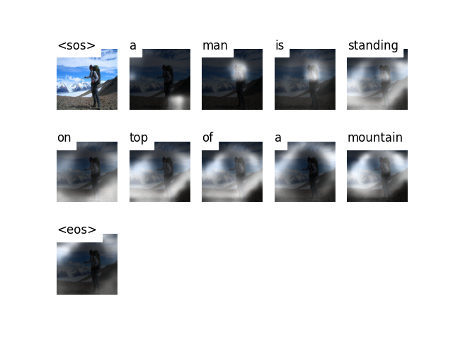

# 
<h1 align="center">
        Show, Attend & Tell
</h1>
<h4 align="center">
    <p>
        <b>简体中文</b> |
        <a href="https://github.com/NicholasKX/ShowAttendTell/blob/main/README.md">English</a>
    </p>
</h4>

<h3 align="center">
    <p>基于Mindspore实现Show, Attend and Tell: Neural Image Caption Generation with Visual Attention</p>
</h3>


## 必要前提

* Mindspore=2.0.0
* 卷积神经网络（Convolutional Neural Networks）
* LSTM
* 注意力机制（Attention Mechanism）

## 环境
* Ascend 910 or RTX 3090
* Mindspore=2.0.0
* Python=3.8.0
* mode=ms.PyNative（动态图）

## 使用方法
克隆该仓库:
```bash
git clone https://github.com/NicholasKX/ShowAttendTell.git
```

### 1. Flickr8k Dataset 
* 准备数据集  ([**Flickr8k**](https://www.kaggle.com/shadabhussain/flickr8k)). 
* 提取图片到**Images**文件夹，提取文本到**captions.txt**文件. 
* 把**Images**and**captions.txt** 放到同一个文件夹（**flickr8k**）下 
* 使用 [**Andrej Karpathy**](http://cs.stanford.edu/people/karpathy/deepimagesent/caption_datasets.zip)划分的训练集, 验证集, 测试集.
```angular2html
-- flickr8k
    |-- Images
      |-- 1000268201_693b08cb0e.jpg
      |-- ......
    |-- captions.txt
    |-- train.csv
    |-- val.csv
    |-- test.csv
```


### 2. 训练
* 运行如下代码 : 
```bash
python train.py
```
* 需要在 _train.py_ 文件中指定 **checkpoint file** 的路径.
* 可以自行修改 _train.py_ 文件中的超参数.
* 训练好的模型会保存到指定目录下（_model_saved_）.


### 3. 推理
* 下载好预训练模型到本地（_model_saved_）并指定路径.
* 运行如下代码 : 
```bash
python caption.py --img <path_to_image> --beam_size <beam search>
```

### 4. 评估
* Run the following command : 
```bash
python evaluation.py
```

### 5. 结果
一些结果如下:
<p align="center">
  
</p>
<pre><code> Caption : a dog is running on the beach . </code></pre> 

<p align="center">
  
</p>
<pre><code> Caption : a man is standing on top of a mountain . </code></pre> 

Bad Case: 
<p align="center">
  
</p>
<pre><code> Caption : a man rides a motorcycle. </code></pre> 

## References
* **Link**: [Show, Attend and Tell: Neural Image Caption Generation with Visual Attention](https://arxiv.org/abs/1502.03044)
* Modified from **Link**: https://github.com/sgrvinod/a-PyTorch-Tutorial-to-Image-Captioning
